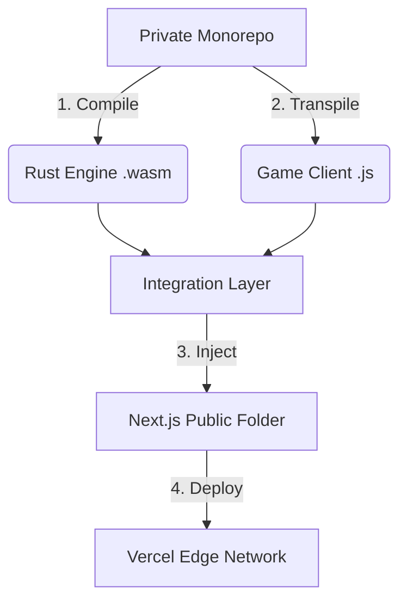

# Vibe Heist - Web Portal 🌐

**Status:** 🚧 In Active Development

Welcome to the public web portal for **Vibe Heist**, an experimental high-fidelity open-world crime simulation running entirely in the browser.

This repository handles the **Authentication**, **Launcher UI**, and **Asset Delivery** for the game.

## 🏗️ Architecture & Code Protection

This project utilizes a unique **"Injected Client" architecture** to maintain open-source transparency for the engine while protecting the proprietary game logic.

### The "Split-Repo" Strategy

The application is composed of three distinct layers during the CI/CD pipeline:

1. **The Engine (Public)**: A generic Rust/WASM physics simulation (`/sim`).
2. **The Shell (Public)**: This Next.js repository, handling UI and Auth.
3. **The Game Client (Private)**: The actual gameplay code, assets, and missions.

### 🛡️ How it builds

When deployed to Vercel, a custom build pipeline executes the following security flow:

**Result:** The public can view the website code and the physics engine source, but the specific game logic (The "Heist" mechanics) is injected only at build time.

> **Security Note:** The raw TypeScript source code for the game logic never leaves the private repository, appearing in the browser only as minified, compiled JavaScript bundles.

## 🛠️ Tech Stack

- **Framework**: Next.js 16
- **Language**: TypeScript
- **Styling**: Tailwind CSS
- **Game Runtime**: Babylon.js (WebGPU) + WebAssembly (Rust)

## 🎮 Play the Greybox

The current deployment features a "Greybox" technical demo, showcasing the Rust-Rapier physics integration without final assets.

[Link to Live Demo] (Coming Soon)
